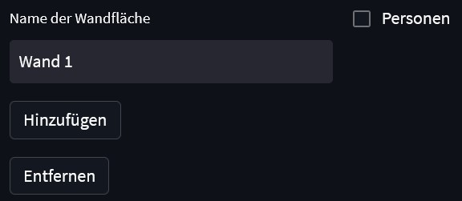
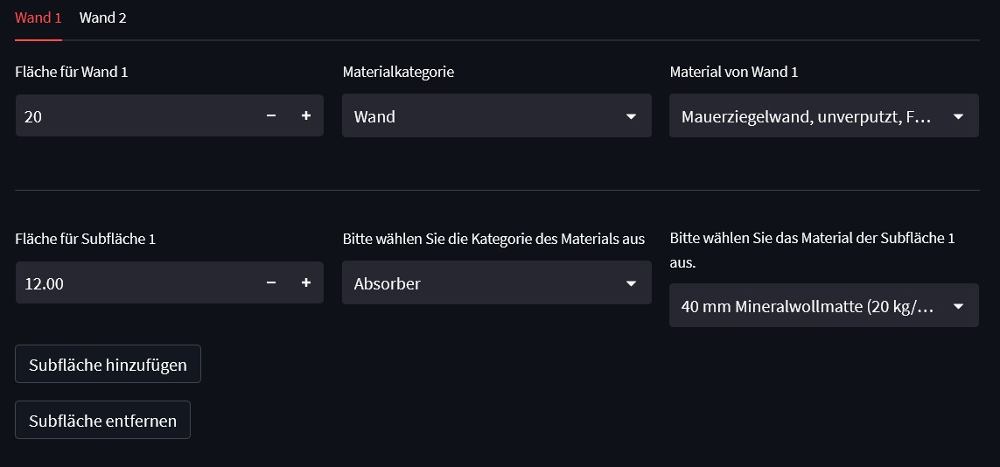
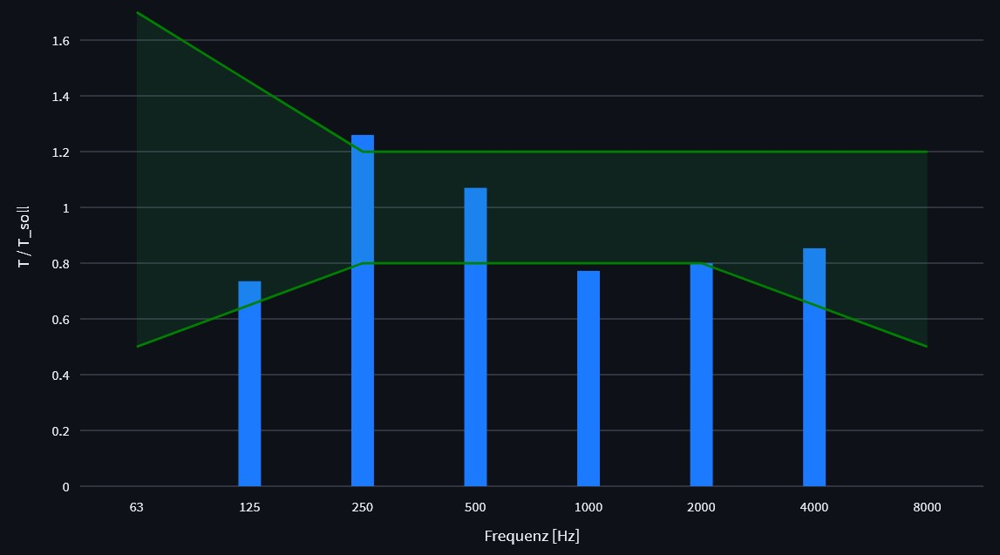
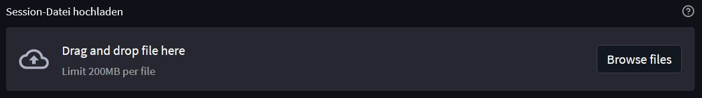
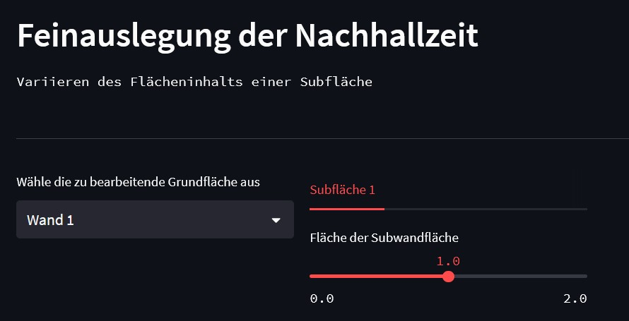
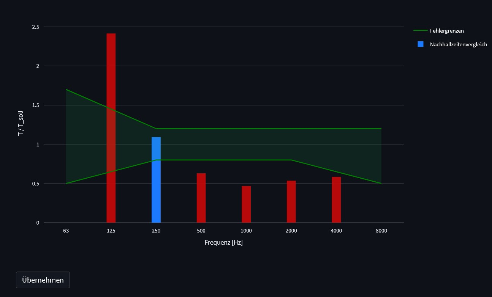

Usage
=====

Run Raumakustik App
-------------------

Open a console navigate to the raumakustik directory:

.. code-block:: console

	streamlit run Nachhallzeitenanalyse.py

Enter room properties
---------------------

Choose usecase and set volume of the room:

.. image:: _images/Usecase_Volume.jpg
   :width: 500
   

Add walls and choose if you want to add persons:

Choose material and area of the wall:

.. image:: _images/ChooseMaterial.jpg
   	:width: 900

Each wall has its own tab. You can add and remove subsurfaces by clicking on the buttons:

Display of results and Save&Load
--------------------------------

Display of reverberation time:

.. image:: _images/Nachhallzeit.jpg
   :width: 900

Display of speech intelligibility:

Options for plot display:

.. image:: _images/ZoomPlotEtc.jpg
   :width: 900

Load room configuration:

Save room configuration and export pdf protocol:

Database of materials
---------------------

Check absoprtion coefficients of materials:

.. image:: _images/Datenbank.jpg
   :width: 900

Add new material to database:

.. image:: _images/AddData.jpg
   :width: 900

Feinauslegung
---------------------

You can adjust the size of all subwalls according to your requirements without changing your configuration:

The results get displayed immediately. Once you are satisfied with the result you can accept the changes to your configuration:

    